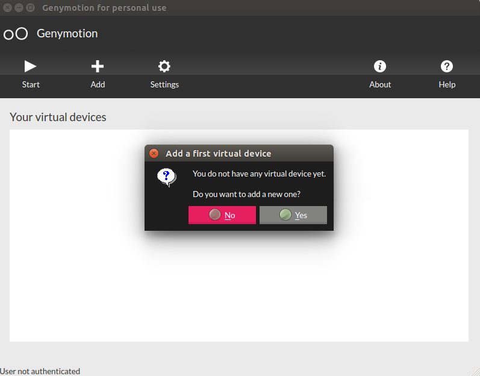
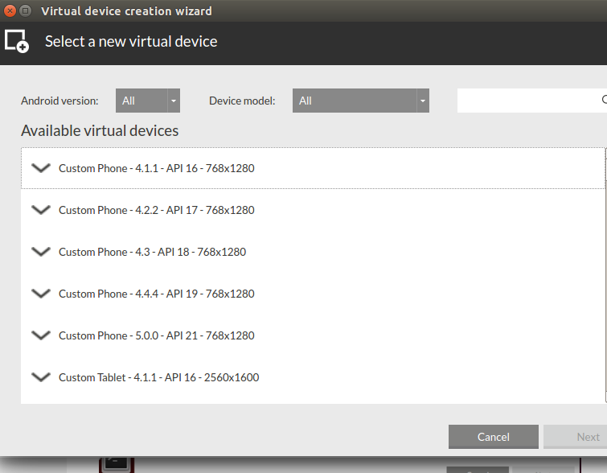

#Documentación VirtualBoard

##¿Qué es VirtualBoard?

VirtualBoard es una aplicación que permitirá que varias personas trabajen con sus tablets o móviles sobre una pantalla compartida de forma sincronizada y con la misma experiencia de usuario que si estuviesen trabajando sobre papel.

Conoce más [aquí](https://github.com/IV-2014/VirtualBoard/blob/master/README.md)

##Documentación Despliegue

[Ver documentacion](https://github.com/IV-2014/VirtualBoard/blob/master/ServerConfiguration/DocumentacionDespliegue.md)

##Testear una aplicación android en una Máquina virtual en linux
#####En este tutorial vamos a explicar como montar tu maquina virtual Android y como conectarla a Android Studio para poder hacer pruebas previas a lanzar nuestra App.

###1º Instalar VirtualBox

Para instalar virtual box, solo tendremos que ir al centro de software de nuestro linuz y desde ahi descargar Virtualbox. Es lo mas sencillo y rapido.

###2º Instalar Genymotion
 El primer paso es [registrarnos en Genymotion](https://www.genymotion.com/#!/auth/account-creation).
 
 Tras acceder al link que nos envian a nuestro email, lo [descargamos](https://www.genymotion.com/#!/download). Al hacer esto, se descargara un archivo .bin , le damos permiso de ejecucion y lo ejecutamos [asi](http://showterm.io/81fc6d57e822570542781).
 
Ahora vamos a la carpta genymotion que se ha creado y ejecutamos el archivo genymotion  con:

	./genymotion
    
Nos aparecera esta ventana, y clicamos en YES:

Nos logueamos y elegimos el tipo de dispositivo que queremos utilizar:

Una vez elegida, se descargara la imagen que queremos. Arranncamos la maquina, y ya la tenemos fucnionando.

Una vez que es esta arrancada, solo nos queda conectarla con nuestro Android Studio. Para esto abriremos Android Studio y iremos a:

	File > Settings
    Plugins > Browse Repositories
    Buscamons genymotion y pulsamos en Download and install 