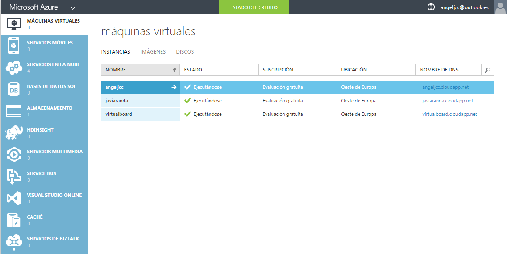
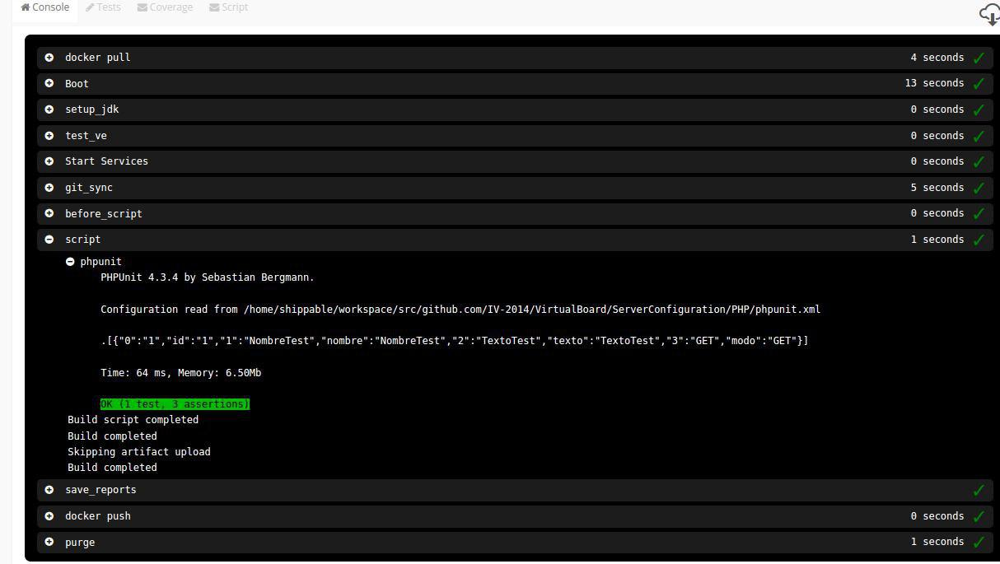
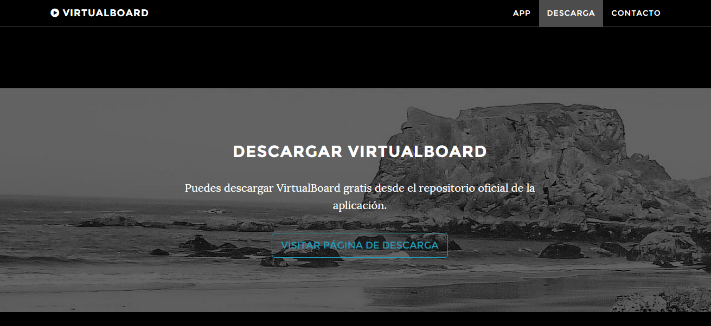

#VirtualBoard
---

#####Índice de contenidos
######[Descripción general](https://github.com/IV-2014/VirtualBoard/blob/master/Documentacion/Documentacion.md#descripci%C3%B3n-general-1)
- [¿Qué es vitualboard?](https://github.com/IV-2014/VirtualBoard/blob/master/Documentacion/Documentacion.md#qu%C3%A9-es-virtualboard)

######[Organización del trabajo](https://github.com/IV-2014/VirtualBoard/blob/master/Documentacion/Documentacion.md#organizaci%C3%B3n-del-trabajo-1/)
######[Tecnología utilizada](https://github.com/IV-2014/VirtualBoard/blob/master/Documentacion/Documentacion.md#tecnolog%C3%ADa-utilizada-1)
- [Cliente](https://github.com/IV-2014/VirtualBoard/blob/master/Documentacion/Documentacion.md#tecnolog%C3%ADa-utilizada-1)
- [Servidor](https://github.com/IV-2014/VirtualBoard/blob/master/Documentacion/Documentacion.md#tecnolog%C3%ADa-utilizada-1)
	- [Despliegue](https://github.com/IV-2014/VirtualBoard/blob/master/Documentacion/Documentacion.md#despliegue)
	- [Aprovisionaminto](https://github.com/IV-2014/VirtualBoard/blob/master/Documentacion/Documentacion.md#aprovisionamiento)

######[Integración continua](https://github.com/IV-2014/VirtualBoard/blob/master/Documentacion/Documentacion.md#integraci%C3%B3n-continua)

######[Test PHP](https://github.com/IV-2014/VirtualBoard/blob/master/Documentacion/Documentacion.md#test-php)

######[Sitio web](https://github.com/IV-2014/VirtualBoard/blob/master/Documentacion/Documentacion.md#sitio-web)

######[Proyecto futuro](https://github.com/IV-2014/VirtualBoard/blob/master/Documentacion/Documentacion.md#proyecto-futuro-1)

######[Licencia](https://github.com/IV-2014/VirtualBoard/blob/master/Documentacion/Documentacion.md#licencia)

---
##Descripción general

#####¿Qué es VirtualBoard?

VirtualBoard es una aplicación que permitirá que varias personas trabajen con sus tablets o móviles sobre una pantalla compartida de forma sincronizada y con la misma experiencia de usuario que si estuviesen trabajando sobre papel.

La idea general de la App VirtualBoard es que pueda haber una reunión en la que varias personas trabajen con sus tablets o móviles sobre una pantalla compartida de forma sincronizada y con la misma experiencia de usuario que si estuviesen trabajando sobre papel.

##Organización del trabajo

Tras crear el grupo de compañeros y elegir el proyecto comenzamos con la creación de un repositorio en GitHub, dentro de la organización IV/GII, organización perteneciente a la asignatura de Infraestructura Virtual.

Para coordinarnos de manera eficiente realizamos un grupo en 'Telegram' y un Board en Trello para almacenar la información sobre el proyecto, usuarios y pass, enlaces de ayuda, tutoriales de ayuda, etc.

Además hemos creado una cuenta de correo electrónico para que los interesados puedan contactar con nosotros: virtualboard.iv@gmail.com.

También disponemos de cuenta en la red social Twitter: https://twitter.com/VirtualBoard1

Para trabajar usamos la metodología de trabajo colaborativa usando git y sus issues. De esta forma creamos un Issue por tarea principal a desarrollar o mejora referenciando en cada commit a su issue asociado. Una vez terminada una tarea se cierra el issue.

Git nos ha ayudado a trabajar en grupo teniendo la posibilidad de volver atrás en caso de realizar cambios fallidos.

##Tecnología utilizada

La aplicación actual, está compuesta por dos "partes", servidor-cliente.

Por la parte del **cliente** hemos desarrollado una app para Android con Android Studio y Eclipse, programada en Java. Podemos verla en funcionamiento aquí [aquí](https://github.com/IV-2014/VirtualBoard/blob/master/Images/testAppth01.jpg).

Por la parte del **servidor**:

Como solución de servidor en la nube hemos elegido el servicio de prueba que ofrece Azure donde hemos creado una máquina virtual. Aquí podemos la máquina virtual en ejecución (junto a más las máquinas empleadas para realizar los ejercicios de la asignatura):

####Despliegue:

Ha sido realizado con **[Docker](https://github.com/IV-2014/VirtualBoard/tree/master/despliegue)** que nos permite "empaquetarlo" todo y desplegarlo en cualquier sistema Linux sin necesidad más que de introducir un par de comandos.

####Aprovisionamiento:

Ha sido realizado con **[Ansible](https://github.com/IV-2014/VirtualBoard/tree/master/Aprovisionamiento)** que nos da la posibilidad de autmatizar la instalación de todas las herramientas necesarias para el proyecto. Su funcionamiento es sencillo, todos los comandos de instalación se agrupan en uno o varios archivos .yml que será lanzado con un pequeño script:

`ansible-playbook virtualboard.yml -u virtualboard`

El contenido:

          - hosts: virtualboard

          sudo: yes
          tasks:
          - name: 1. Instalar Apache
            apt: name=apache2 state=present

          - name: 2. Instalar PHP
            apt: name=libapache2-mod-php5 state=present

          - name: 3. Instalar MySQL server
            apt:
              name: "{{ item }}"
            with_items:
              - python-mysqldb
              - mysql-server
              - mysql-client

          - name: Start Mysql Service
            service: name=mysql state=started enabled=yes

          - name: 5. Start Apache
            service: name=apache2 state=running enabled=yes

          - name: 6. Instalar PHPmyadmin
            debconf: name=phpmyadmin question='phpmyadmin/dbconfig-install' value='true' vtype='boolean'

          - name: debconf for pma
            debconf: name=phpmyadmin question='phpmyadmin/app-password-confirm' value='virtualboard' vtype='password'

          - name: debconf for pma
            debconf: name=phpmyadmin question='phpmyadmin/mysql/admin-pass' value='virtualboard' vtype='password'

          - name: debconf for pma
            debconf: name=phpmyadmin question='phpmyadmin/mysql/app-pass' value='virtualboard' vtype='password'

          - name: debconf for pma
            debconf: name=phpmyadmin question='phpmyadmin/reconfigure-webserver' value='' vtype='multiselect'

          - name: Instalar PHPmyadmin
            apt: pkg=phpmyadmin state=present

          - name: Configurando PHPmyadmin
            file: path=/var/www/html/phpmyadmin src=/usr/share/phpmyadmin state=link

          - name: 7. Instalando git.
            apt: name=git state=present

          - name: 8. Clonando Repositorio desde git
            command: git clone  https://github.com/IV-2014/VirtualBoard.git

          - name: 9. Copiar php
            copy: src=../ServerConfiguration/PHP/src/ dest=/var/www/html mode=0644

          - name: 10. Crear Base de Datos
            mysql_db: name=virtualboardphp state=present

          - name: 11. Crear user y password para conectar a la base de datos
            mysql_user: name=virtualboard password=virtualboard priv=*.*:ALL state=present

          - name: 12. Creacion de tabla
            script: ./crearTabla.sh

Esto tendrá efecto sobre la máquina o máquinas que hayan sido indicadas en el archivo hosts:

`[virtualboard]
virtualboard.cloudapp.net`

##Integración continua

La Integración continua sobre el código de nuestra aplicación que va situado en el servidor, hemos utilizado travis, shippable y circle. 

Estado de Shippable:   

Estado de Travis: 

Para realizar la integración continua de nuestra aplicación Android hemos estado probando con jenkins, ya que entre otras cosa nos permite realizar los test cuando por ejemplo hay alguna modificación en el repositorio (aunque no es recomendable ya que se puede sobrecargar demasiado el servidor si se están trabajando muchos al mismo tiempo), Si se pasan los test se compilara de nuevo nuestra aplicación, con lo que siempre se tiene actualizada.

Otra de las ventajas es poder seleccionar también ramas de dentro del proyecto (por lo que se pueden desarrollar en paralelo las distintas versiones) y que está disponible para cualquier sistema operativo prácticamente.

Para conocer más sobre los pasos a seguir para realizar la integración continúa describimos todo el proceso (aquí.)[https://github.com/IV-2014/VirtualBoard/blob/master/jenkins/jenkins.md]
- - -

##Test PHP

Hemos realizado una serie de test para la parte del servidor (programada en PHP) con PHPUnit, que es un entorno para realizar pruebas unitarias en el lenguaje de programación PHP. 

Un ejemplo de ejecución:

##Sitio Web

Virtualboard también dispone de un sitio web desde el cual se puede acceder a nuestros perfiles en las redes social, descargar la aplicación o obtener información sobre la misma.

Para realizar el sitio web hemos empleado una plantilla de 'Bootstrap' que hemos adaptado a nuestro gusto y necesidad con html y css.

Se puede acceder desde [aquí](http://iv-2014.github.io/VirtualBoard/)

##Proyecto futuro

El proyecto inicial varía notablemente con el finalmente llevado a cabo, aún sí estos son los puntos a desarrollar ahora en caso de continuar con el proyecto:

- Funcionalidades de pizarra:

Se creará una pantalla donde se pueda escribir o pintar. La escritura se haría con el teclado del dispositivo. A la hora de pintar se hara directamente en la pantalla del dispositivo y sera lo mas real posible.

- Almacenaje/Sincronización de trazos

Se podrá almacenar y comunicar los trazos que se hagan en el canvas. Para ello convertiremos los diferentes trazos a SVG. El que los trazos sean vectoriales es importante ya que cada dispositivo puede tener una resolución de pantalla diferente.

Por un lado que almacenaremos toda la información de trazos en un servidor y por otro ver la mejor forma de mantener sincronizados los dispositivos entre si para que todos muestren los contenidos que se vayan dibujando.

- Proyección en pantalla wifi.

Con pantalla wifi nos referimos a un dispositivo con soporte airplay, chromecast o miracast.

Al igual que se ven los contenidos en los diferentes dispositivos, además se vean en una pantalla principal como puede ser una TV o un proyector.

##Licencia

El proyecto lo hemos publicado con una licencia [GPLV2](https://github.com/IV-2014/VirtualBoard/blob/master/LICENSE)
