##Método de testeo mediante el programa Testdroid.

###¿Qué es Testdroid?

- Explicación en la siguiente páginas:

	- [Página 1](http://es.paperblog.com/testdroid-comprueba-el-funcionamiento-de-tu-aplicacion-android-en-varios-dispositivos-981937/)

	- [Página 2](http://www.elandroidelibre.com/2012/03/comprueba-el-rendimiento-de-tus-aplicaciones-en-mas-de-100-terminales-con-testdroid.html)

###Uso de Testdroid
- Lo primero que vamos hacer es registrarnos en la [página](http://testdroid.com/#)

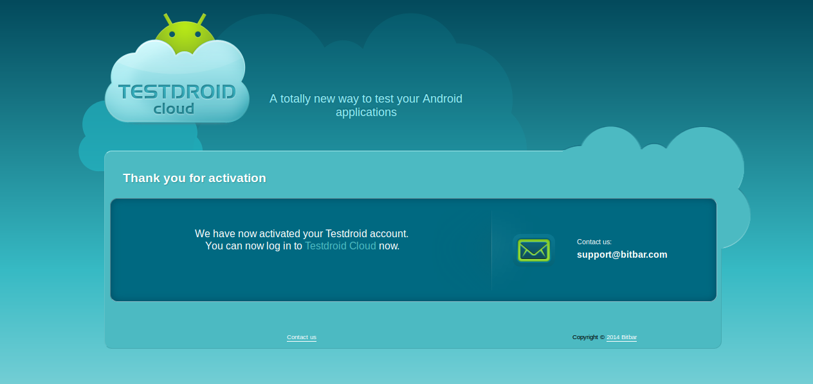

- Una vez registrados, nos logeamos:

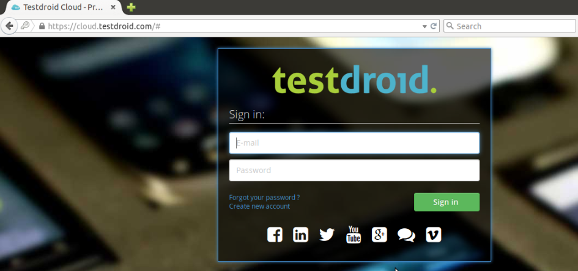

- Dentro de nuestra cuenta en Testdroid nos aparecerá lo siguiente:

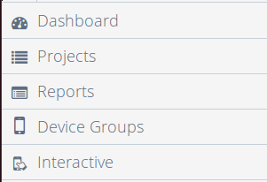

- Dentro del Dashboard aparecerá lo siguiente:

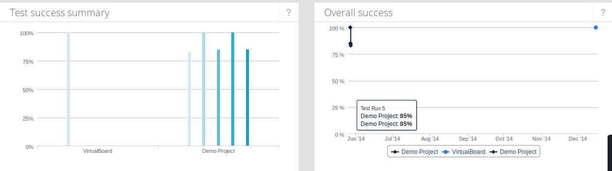

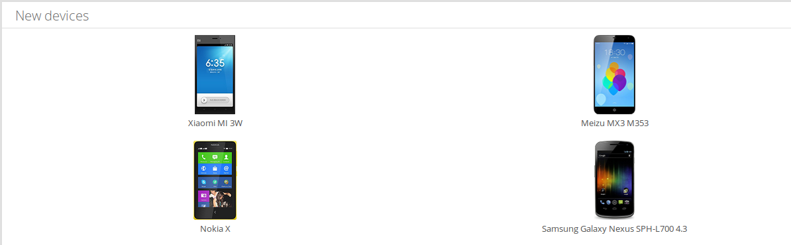

- Dentro de projects:

	- Podemos crear un proyecto, en mi caso yo he creado un proyecto que se llama VirtualBoard.

	

	- Dentro del proyecto de VirtualBoard:

	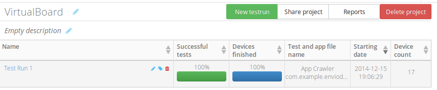

		- Aparece el test que he realizado.
		- Si queremos crear un test pulsamos el botón New testrun.

        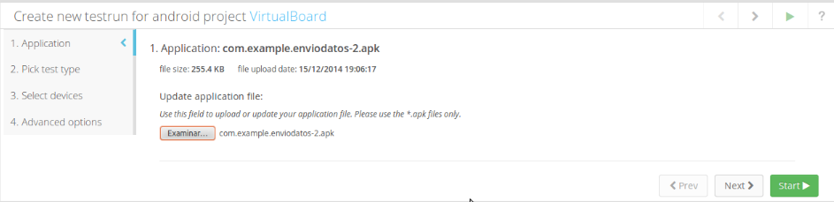
        Escogemos la aplicación a la que le queremos hacer el test y pulsamos start.
        - Una vez que pulsamos start, esperamos a que termine de hacer el test y aparecerá lo siguiente:

		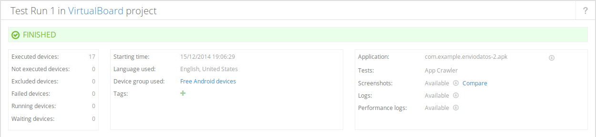
        Como vemos la aplicación ha terminado de testearse.

        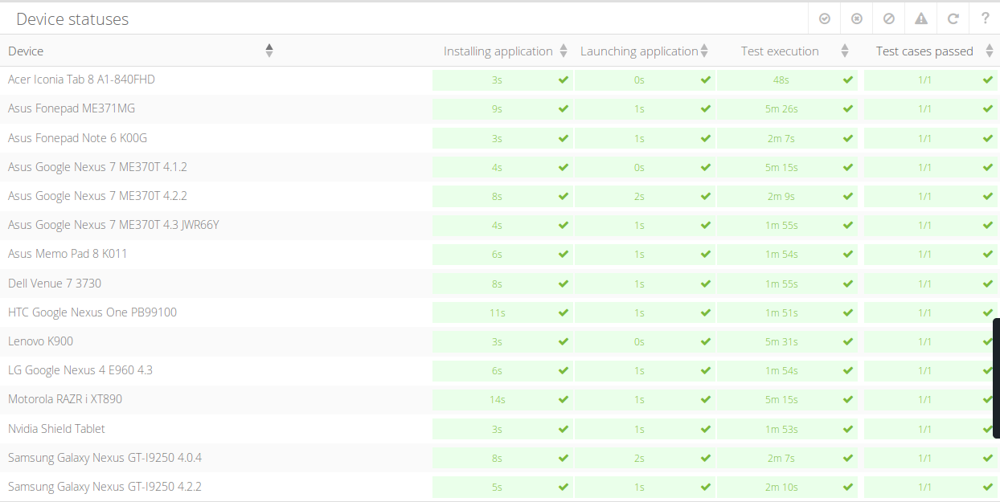
        
		Las dos capturas anteriores muestran todos los móviles donde se ha realizado el testeo de la aplicación.
        
		- Voy a mostrar las capturas de algunos móviles de los que aparecen en las capturas anteriores.
			- ZTE Grand X In P940:
				- Steps in testEverything method:
				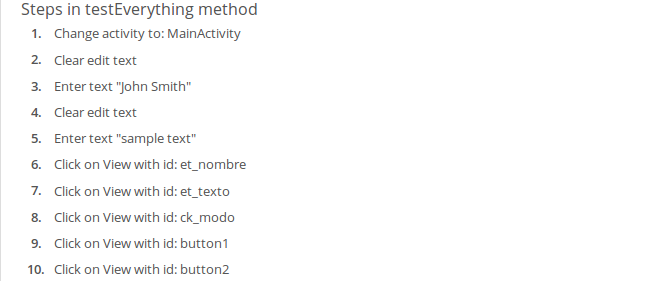
                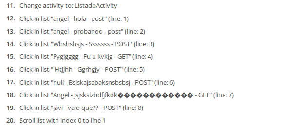
                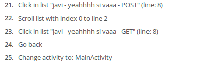
    			- Screenshots by Test Steps:
    			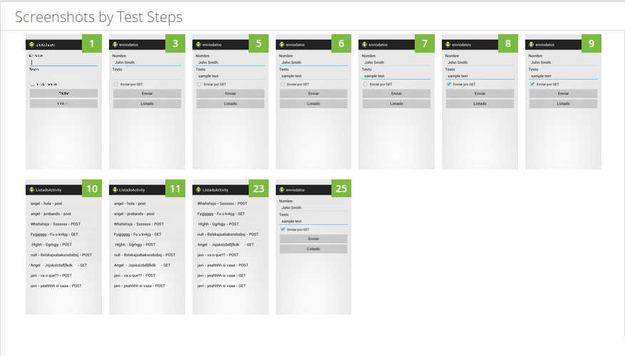
                
     

Tutoriales Testdroid
[Enlace](https://www.youtube.com/playlist?list=PLY1_jWSmq0VLXUwfI1d6AMyOB9Z8JZYSh)