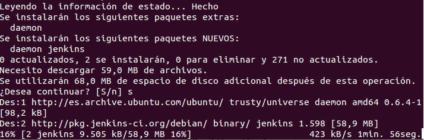
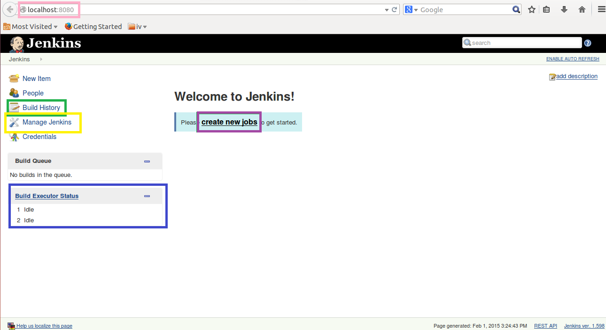
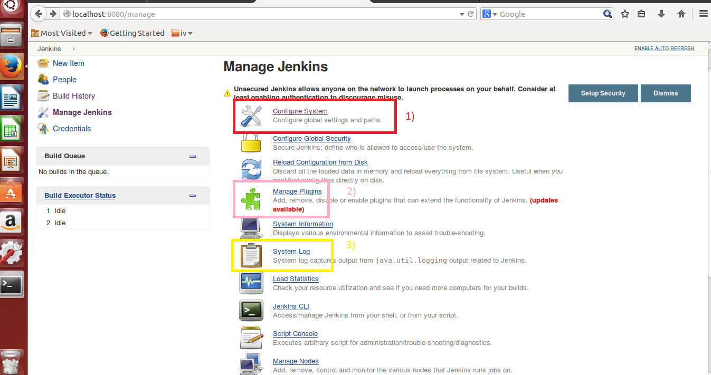
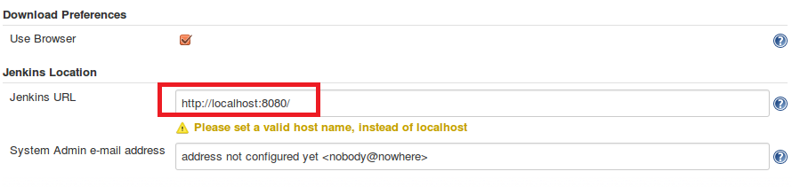
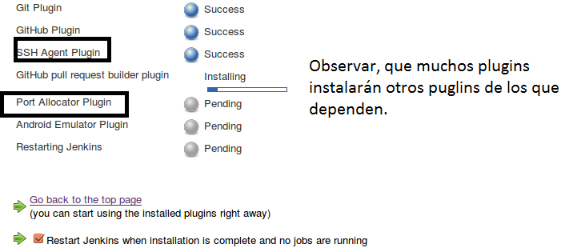
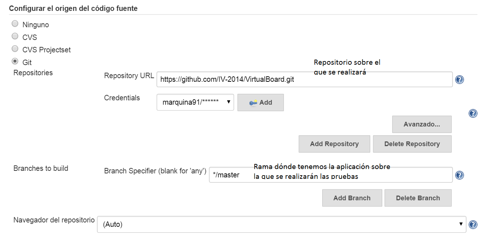
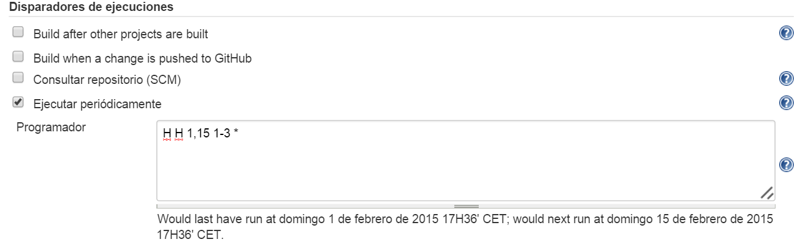
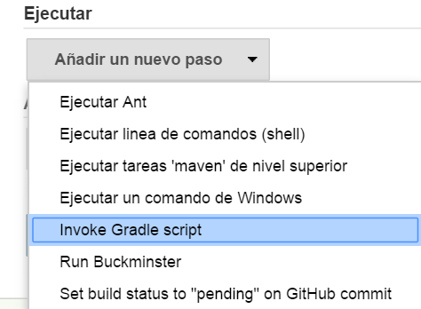
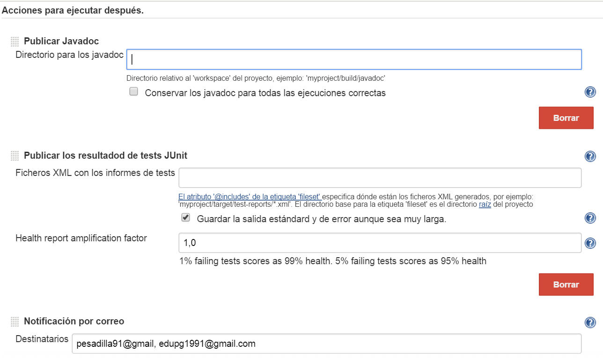

### Integración Continua de la APP :

Para realizar la integración continua de nuestra aplicación Android hemos estado probando con jenkins, ya que entre otras cosa nos permite realizar los test cuando por ejemplo hay alguna modificación en el repositorio (aunque no es recomendable ya que se puede sobrecargar demasiado el servidor si se están trabajando muchos al mismo tiempo), Si se pasan los test se compilara de nuevo nuestra aplicación, con lo que siempre se tiene actualizada.

Otra de las ventajas es poder seleccionar también ramas de dentro del proyecto (por lo que se pueden desarrollar en paralelo las distintas versiones) y que está disponible para cualquier sistema operativo prácticamente.

Ahora vamos a explicar como lo hemos realizado:

###### 1) Instalación

 Descargarse jenkins, desde la página oficial -> [Descargar](http://mirrors.clinkerhq.com/jenkins/debian/jenkins_1.598_all.deb) e instalarlo.
Aunque si se está usando ubuntu (como en nuestro caso), abrid una terminal y ejecutar los siguientes comandos:

- `wget -q -O - https://jenkins-ci.org/debian/jenkins-ci.org.key | sudo apt-key add -`	 
	
- `sudo sh -c 'echo deb http://pkg.jenkins-ci.org/debian binary/ > /etc/apt/sources.list.d/jenkins.list'`

- `sudo apt-get update`
	
- `sudo apt-get install jenkins`
	
No nos ocupará mucho espacio, unos 68MB (como se puede observar en la captura) y merece la pena por las comodidades que nos va a dar:

Una vez lo tenemos instalado, podremos ya acceder a jenkins mediante un navegador introduciendo la dirección [http://localhost:8080](http://localhost:8080), como podemos observar a continuación (señalado con un cuadro rosa):

En la captura, podemos observar que hemos señalado varias opciones (las más importantes) que vamos a explicar que función tienen:

 - Cuadro Amarillo: Lo más importante antes de crear ninguna tarea, dentro de el tendremos que configurar jenkins si queremos usar algunos plugins (como en nuestro caso, para usar Git y jUnit entre otros), también aquí podremos configurar algunos path, y ver los log de las ejecuciones de nuestras tareas, entre otras cosas.

 - Cuadro Morado: Si pinchamos sobre él creare una nueva tarea para que se realice según una serie de condiciones (que puede ser debido a un cambio en el repositorio o eligiendo unas horas para que se lleve a cabo, aunque esto lo explicaremos más detalladamente más adelante).
 
 - Cuadro Verde: Nos mostrará las estadísticas de las veces que se ha construido la app mediante una gráfica. 
 
 - Cuadro Azul: Nos mostrará las tareas que se están ejecutando o preparándose para ello.

###### 2) Configuración (Manage Jenkins) :

Es el apartado más importante, y cada configuración dependerá del uso que le vayamos a querer dar (nosotros test con jUnit, uso de git, y Android), a continuación mostraremos las opciones más importantes:

1. **Configure System**, En esta opción configuraremos todo lo relacionado con los recursos a usar (path del JDK, de ANT, del Git, etc), dónde se almacenara todo lo que creemos con jenkins (por defecto /var/lib/jenkins), y como acceder a jenkins (en nuestro caso como ya hemos indicado antes lo tenemos [http://localhost:8080](http://localhost:8080), aunque también se podría poner el dominio del servidor (que de hecho es lo recomendable según me he informado)).

 

2. **Manage Plugins**, este es vital ya que a la hora de poder realizar las tareas deberemos tener los puglins instalados para poder llevarlas a cabo (por ejemplo, no podremos realizar los test si no tenemos el puglin jUnit instalado), para nuestro proyecto hemos instalado los siguientes puglins:
	- Plugin Git
	- Plugin GitHub pull request builder
    - Plugin GitHub
	- Plugin Junit
	- Plugin Javadoc
	- Plugin AppThwack
	- Plugin MobileCloud for Jenkins
	- Plugin Android Emulator
	- Plugin Credentials

 Tras instalarlos reiniciamos jenkins para que funcionen correctamente.
 
  

3. **System Log**, Aquí podremos ver todos los Log de nuestras tareas tras ejecutarse, así en caso de errores sabremos en dónde falla.

###### 3) Crear una nueva tarea :

Como ya vimos, en la portada principal del programa, hay una opción para crear una tarea nueva, que señale con un cuadrado morado en la primera captura.

La seleccionamos, tras ello le damos un nombre a la tarea y seleccionamos "Freestyle projec" (aunque hay otra opciones como crearlas a partir de un proyecto que ya tuviéramos antes, pero no será nuestro caso).

Después nos saldrán una serie de opciones para configurar la tarea (como descripción, repositorio, opciones para el built, etc) mostraremos como hemos configurado las más importantes (antes hemos cambiado el idioma a español ya que así podremos ver más información acerca de cada apartado pues jenkins cuenta con unas pestañas en forma de interrogación que te dicen con más detalle que hace en cada caso):

- ** Configurar el origen del código fuente**, Esta es de las más importantes ya que si no ponemos dónde está el código poco se podrá hacer, además necesitaremos dar la información de acceso para que si le damos la opción de publicar algo jenkins pueda hacerlo automáticamente:

  

- ** Disparadores de ejecuciones**, aquí mediante una sintaxis cron, ponemos cada cuanto se ejecutara la tarea, por ejemplo una vez cada 15 días hasta marzo.

  

- ** Ejecutar**, como era de esperar habrá que decirle que tiene que ejecutar, en nuestro caso elegimos el gradle generado por nuestro proyecto (también podríamos a ver ejecutado un maven, si lo hemos importado desde eclipse por ejemplo, pero en nuestro caso Android Studio nos genera el gradle por defecto).

  

- ** Acciones para ejecutar después**, aquí tenemos varias opciones, pero hemos elegido las de notificar los test, que se publique la documentación y que se nos notifique por correo.

  

Y ya tendremos configurado correctamente jenkins para usarlo con nuestra aplicación Android junto con los test creados.