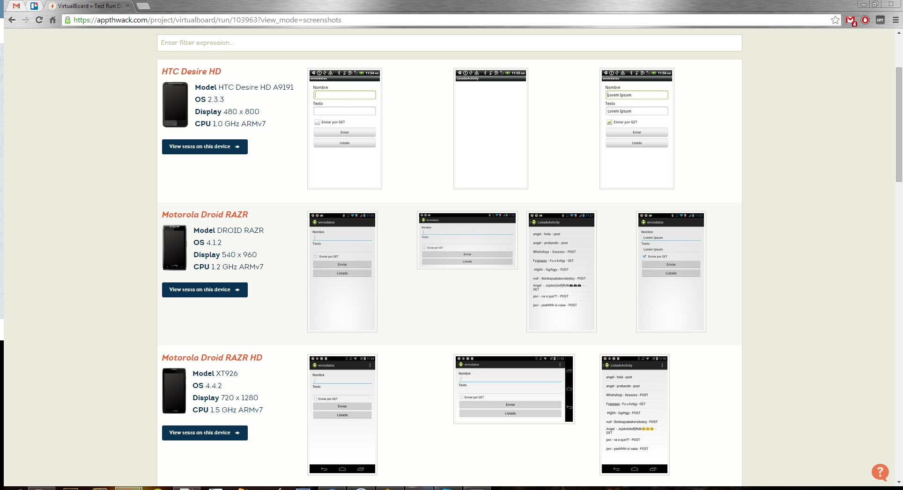
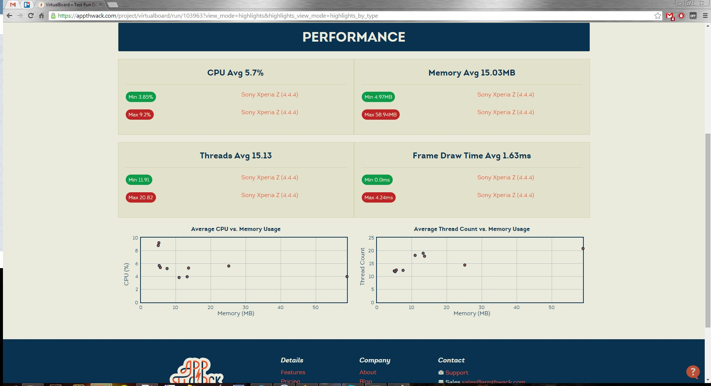
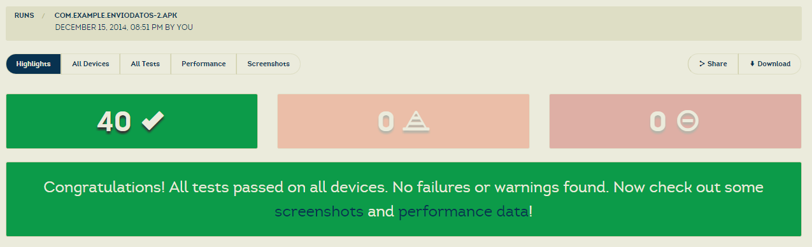

#Testeamos la app con AppThwack
- - - 

Una gran herramienta de testeo de aplicaciones móviles Android y iOS es AppThwack.

Esta herramienta en la nube nos permite subir nuestra aplicación, en nuestro caso un .apk y automáticamente realizar un test.

El test proporciona resultados en distintos terminales como podemos ver a continuación:

Y incluye datos de uso de memoria y CPU:

Y el resultado de errores de la aplicación:

-- [AppThwack](https://appthwack.com/) --

