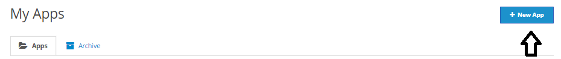
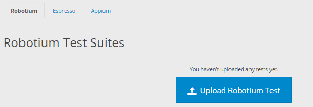
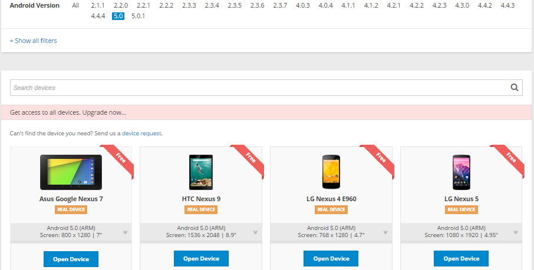
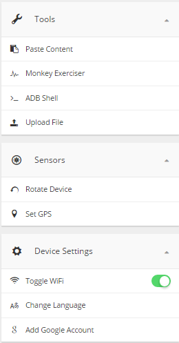
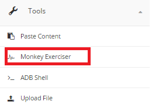
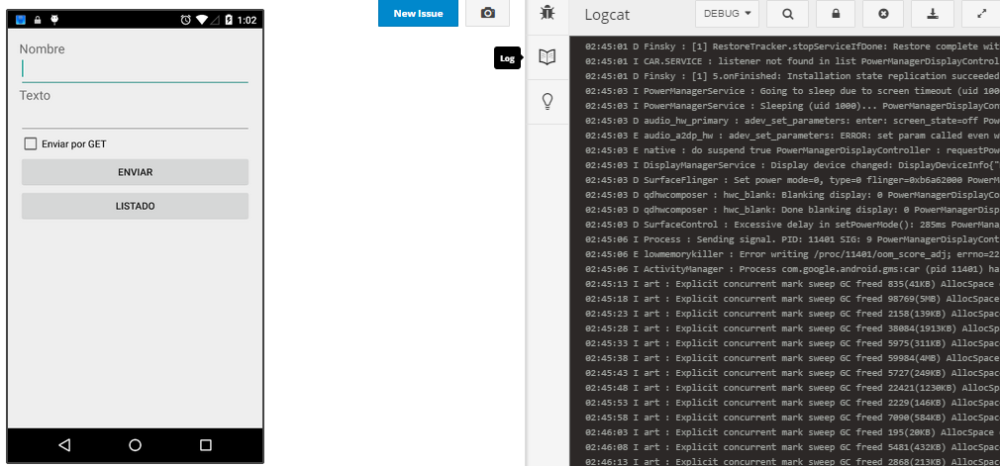
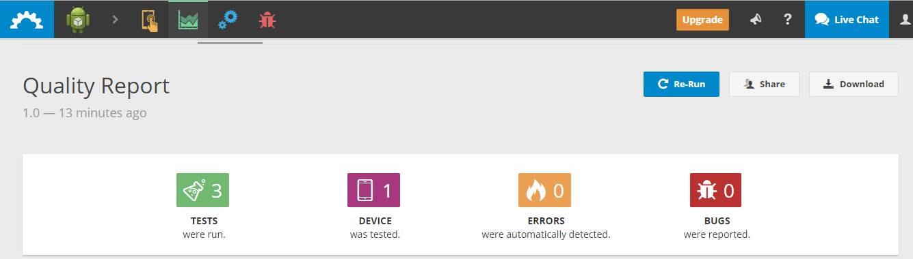
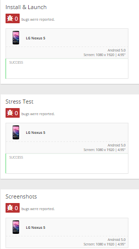
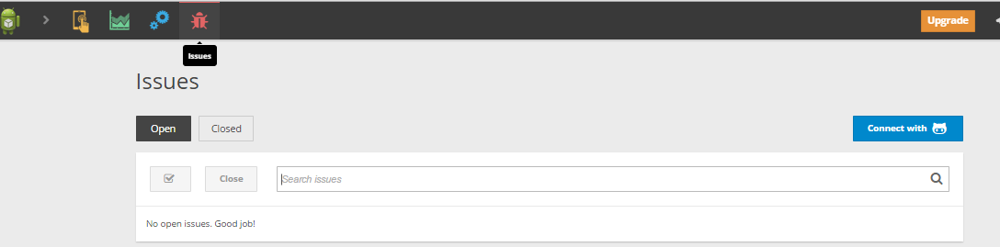

# Testeamos la app con Testobject

[Testobject](https://testobject.com/), es una de las mejores plataformas para realizar test de aplicaciones android (por su velocidad y su variedad de herramientas).

Es gratuito, aunque si mejoras tu cuenta podrás testear tus aplicaciones en móviles no disponibles para los usuarios gratuitos (casi en cualquier móvil existente).

Lo primero que debemos hacer para testear nuestra aplicación es crearnos una cuenta en  [testobject](https://testobject.com/)

Una vez creada confirmamos un email de validación y ya podremos empezar a testear nuestra aplicación.

Lo bueno de esta plataforma es que aparte de test automáticos (como en la mayoría) tienes la posibilidad de testearlo manualmente (en los dispositivos que disponemos según el tipo de cuenta que tienes) lo cual es una ventaja pues no necesitamos un móvil a la última para probar la últimas versiones de android.

Para realizar cualquier test lo primero es subir a nuestras aplicaciones la aplicación que vamos a testear. 

Luego nos pedirá que subamos la aplicación, la seleccionamos, y ya tendremos nuestra aplicación lista para ser testeada.

Notas que hay una pestaña llamada archivo, en esta se guardaran todos los resultados de los test de la aplicacion (cosa útil si al cabo del tiempo queremos ver algún dato del log, por ejemplo).

Ahora vamos a seleccionar la aplicación que queremos testear y ejecutamos el test a realizar.

###Opciones a testear

###### AUTOMATED TEST

Tenemos la opción de hacer test automáticos, hay 3 tipos:

1. Robotium (una de las herramientas más veteranas para [testear aplicaciones Android](https://code.google.com/p/robotium/))
2. Espresso (framework Android para hacer tests de la interfaz de usuario)
3. Appium(muy útil y utilizado para [testear los SDKs](http://appium.io/) tanto de iOS como de Android, en este caso), también usado para testear servidores, en este [GitHub ](https://github.com/appium/sample-code/tree/master/sample-code/examples) podemos encontrar distintos script de testeos para servidores de muchos tipos.

###### MANUAL

Al seleccionar este nos pedirá sobre que versión de android queremos probar la app.

Y en función de la versión elegida nos dejara elegir entre distintos dispositivos (captura tras seleccionar la versión 5.0):

Seleccionamos el dispositivo o dispositivos sobre los que queramos realizar las pruebas, y nos saldrá el simulador del móvil junto con una serie de herramientas muy útiles:

Observamos que podemos subir archivos a la tarjeta SD hipotética del móvil o memoria interna, también podremos probar a encender el WIFI, GPS, rotar la pantalla (todo lo necesario para probar la aplicación como si estuviéramos usando el móvil realmente), y mientras lo probamos podremos ir viendo un monitor de la actividad que está soportando el dispositivo.

Y también el log (en el que podremos ver los fallos, los fallos fatales, la información relacionada con la depuración, y de advertencias), que aparte podremos poner como publico si queremos publicarlo, y descargárnoslo también.

###### QUALITY REPORT

Al darle a ejecutar se pondrá a testearlo y pasaran un rato (pero no pasa nada se nos avisara por correo cuando el test esté finalizado), y tras realizarse obtendremos el número de errores y fallos:

Si le damos a full report obtendremos más datos (como si algún error ha sido en el test o durante la instalación de la aplicación)

######Usando GitHub

Y por último, también se pueden ejecutar aplicaciones usando el repositorio del GitHub dónde se está desarrollando la aplicación que queremos testear. 

